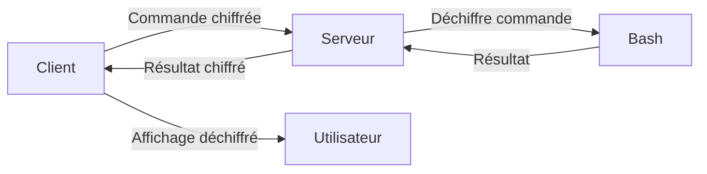

# SSN - Shell sur Netcat

## 📋 Vue d'ensemble du projet

Ce projet implémente un système d'exécution de commandes à distance en utilisant Bash et netcat. Il s'agit d'une progression en 4 exercices, chacun ajoutant des fonctionnalités de sécurité et de complexité.

**Technologies utilisées :**
- Bash comme language
- Netcat (nc) pour la communication réseau
- Named pipes (FIFO) pour la communication bidirectionnelle
- Chiffrement par substitution monoalphabétique (tr)

---

## ⚙️ Prérequis globaux

> [!IMPORTANT]
> Ces prérequis sont nécessaires pour tous les exercices du projet.

### Logiciels requis
- **Bash** - version 5.2.37
- **Netcat** (`nc`) - version GNU 0.7.1

### Vérification de l'installation

```bash
# Vérifier Bash
bash --version

# Vérifier Netcat
nc --version
```

### Structure des fichiers

```
.
├── configuration.conf
├── exercice1.sh
├── exercice2.sh
├── exercice3.sh
└── exercice4
    ├── client.sh
    ├── configuration.conf
    └── server.sh
```

---

## 🏁 Exercice 1 - Accueil du client

### 🎯 Objectif
Créer un serveur TCP basique qui écoute sur le port 12345 et accueille chaque client avec un message de bienvenue et la date de connexion. Le serveur doit rester en vie après chaque déconnexion client.

### 🚀 Comment exécuter

> [!TIP]
> Utilisez deux terminaux pour tester : un pour le serveur, un pour le client.

#### Étapes :

<details>
<summary><strong>1. Lancer le serveur</strong></summary>

```bash
chmod +x exercice1.sh
./exercice1.sh
```

</details>

<details>
<summary><strong>2. Se connecter depuis un autre terminal</strong></summary>

```bash
nc localhost 12345
```

</details>

<details>
<summary><strong>3. Observer le résultat</strong></summary>

```
Bienvenue
Wed Jun  4 08:26:27 PM CEST 2025
```

</details>

<details>
<summary><strong>4. Fermer la connexion</strong></summary>

```bash
# Côté client : Ctrl+C
# Le serveur continue de tourner et attend une nouvelle connexion
```

</details>

### 🏗️ Architecture technique

| Composant | Rôle | Justification |
|-----------|------|---------------|
| **Named pipe (FIFO)** | Communication bidirectionnelle | Netcat ne permet que l'unidirectionnel par défaut |
| **Boucle infinie** | Redémarrage automatique | Maintien du service après déconnexion |
| **Fonction `interpret()`** | Traitement logique | Séparation des responsabilités |

---

## 💻 Exercice 2 - Exécution de commandes distantes

### 🎯 Objectif
Étendre le serveur pour permettre l'exécution de commandes bash envoyées par le client, avec retour des résultats.

### 🚀 Comment exécuter

<details>
<summary><strong>1. Lancer le serveur</strong></summary>

```bash
chmod +x exercice2.sh
./exercice2.sh
```

</details>

<details>
<summary><strong>2. Se connecter et tester</strong></summary>

```bash
nc localhost 12345
```

</details>

<details>
<summary><strong>3. Tester des commandes</strong></summary>

```bash
# Exemples de commandes à taper côté client
ls -la
pwd  
date
echo "Hello World"
whoami
```

**Output exemple:**
```bash
$ ls -la
total 36
drwxr-xr-x 5 majvax majvax 4096 Jun  4 20:27 .
drwxr-xr-x 6 majvax majvax 4096 May 28 13:41 ..
-rw-r--r-- 1 majvax majvax   16 May 28 13:41 configuration.conf
-rwxr-xr-x 1 majvax majvax  228 Jun  4 20:24 exercice1.sh
-rwxr-xr-x 1 majvax majvax  778 Jun  4 20:27 exercice2.sh
-rw-r--r-- 1 majvax majvax 1163 Jun  4 20:13 exercice3.sh
drwxr-xr-x 2 majvax majvax 4096 Jun  4 20:13 exercice4
prw-r--r-- 1 majvax majvax    0 Jun  4 20:28 fifo
drwxr-xr-x 7 majvax majvax 4096 Jun  4 20:13 .git
drwxr-xr-x 3 majvax majvax 4096 May 28 13:41 .github

$ pwd
/home/majvax/Documents/tp-unix-ssn

$ date
Wed Jun  4 08:28:41 PM CEST 2025
```

</details>

### 🏗️ Architecture technique

> [!NOTE]
> **Nouvelles fonctionnalités par rapport à l'exercice 1**

- 🔒 **Commande `/close`** : Fermeture propre du serveur (sans Ctrl+Z), permet la réutilisation du port 
- ⚡ **`bash -c`** : Exécution des commandes avec préservation des arguments  
- 🔄 **Gestion des codes de retour** : Contrôle de la boucle principale via le retour de `interpret()`
- 🔧 **Subshell** : Fonction exécutée dans un sous-shell (nécessite `$?` pour la valeur de retour)

---

## 🔐 Exercice 3 - Authentification par mot de passe

### 🎯 Objectif
Ajouter une couche de sécurité en demandant un mot de passe avant d'autoriser l'exécution de commandes.

### 📋 Configuration requise

> [!WARNING]
> Un fichier de configuration est maintenant nécessaire !

<details>
<summary><strong>Créer le fichier `configuration.conf`</strong></summary>

```bash
echo 'password=coucou' > configuration.conf
```

**Contenu du fichier:**
```bash
password=coucou
```

</details>

### 🚀 Comment exécuter

<details>
<summary><strong>1. Préparer la configuration</strong></summary>

```bash
echo 'password=coucou' > configuration.conf
```

</details>

<details>
<summary><strong>2. Lancer le serveur</strong></summary>

```bash
chmod +x exercice3.sh
./exercice3.sh
```

</details>

<details>
<summary><strong>3. Séquence d'authentification</strong></summary>

```bash
nc localhost 12345
```

**Interaction complète:**
```
Veuiller entrer un mot de passe.
coucou                                 # ← Vous tapez le mot de passe
Mot de passe bon!

ls                                     # ← Maintenant vous pouvez exécuter des commandes
configuration.conf
exercice1.sh
exercice2.sh
exercice3.sh
exercice4
fifo

pwd
/home/majvax/Documents/tp-unix-ssn

/close                                 # ← Fermeture propre
bye bye!
```

</details>

### 🏗️ Architecture technique

> [!NOTE]
> **Ajouts de sécurité**

| Fonctionnalité | Implémentation | Avantage |
|----------------|----------------|----------|
| **Lecture config** | `source configuration.conf` | Configuration externe flexible |
| **Validation** | Test d'existence `${password+x}` | Détection des erreurs de config |
| **Authentification** | Vérification avant commandes | Sécurité de base |
| **Session** | Réauth à chaque connexion | Isolation des sessions |

---

## 🔒 Exercice 4 - Communication chiffrée

### 🎯 Objectif
Implémenter un chiffrement par substitution monoalphabétique pour sécuriser les communications client-serveur.

### 📋 Configuration étendue

<details>
<summary><strong>Mettre à jour `configuration.conf`</strong></summary>

```bash
echo key=QWERTYUIOPASDFGHJKLZXCVBNM >> configuration.conf
```

**Structure de la clé:**
```
Alphabet normal: ABCDEFGHIJKLMNOPQRSTUVWXYZ
Clé de subst. :  QWERTYUIOPASDFGHJKLZXCVBNM
```

</details>

### 🚀 Comment exécuter

> [!TIP]
> Cet exercice nécessite **deux scripts** : un serveur et un client.

<details>
<summary><strong>1.  Lancer le serveur</strong></summary>

**Terminal 1:**
```bash
chmod +x server.sh
./server.sh
```

</details>

<details>
<summary><strong>2. Lancer le client</strong></summary>

**Terminal 2:**
```bash
chmod +x client.sh
./client.sh
```

</details>

<details>
<summary><strong>3. Utilisation complète</strong></summary>

**Interaction complète:**
```
Veuiller entrer un mot de passe.
coucou
Mot de passe bon!

ls -l
total 12
-rwxr-xr-x 1 majvax majvax  518 Jun  4 20:43 client.sh
-rw-r--r-- 1 majvax majvax   47 Jun  4 20:13 configuration.conf
prw-r--r-- 1 majvax majvax    0 Jun  4 20:43 fifo
-rwxr-xr-x 1 majvax majvax 2109 Jun  4 20:42 server.sh

pwd
/home/majvax/Documents/tp-unix-ssn/exercice4

date
Wed Jun  4 08:44:03 PM CEST 2025

echo "test"
test

/help
Available commands:
/close: close the server
/exit: exit the server
/help: show this help message
<any other command>: execute the command in bash

/exit
```

**Exemple de session avec la mauvaise clé:**
```
$ ./client.sh
Fxemppxt xrdtxt er qsd wx zbccx.       # ← le serveur demande le mot de passe
coucou                                 # mais la clé n'étant pas bonne, on ne comprends rien!
Qsd wx zbccx ybeh.

read(net): Connection reset by peer
```

</details>

### 🏗️ Architecture technique

> [!IMPORTANT]
> **Architecture client-serveur avec chiffrement complet**

#### 🔐 Algorithme de chiffrement

```bash
# Alphabet normal
ABCDEFGHIJKLMNOPQRSTUVWXYZ
# Clé de substitution  
QWERTYUIOPASDFGHJKLZXCVBNM

# Exemple: "hello" → "itssg"
# h→i, e→t, l→s, l→s, o→g
```

#### 📡 Flux de communication



#### 🔧 Composants

| Fichier | Rôle | Fonctions clés |
|---------|------|----------------|
| **`server.sh`** | Serveur principal | `send()`, `decode()`, `interpret()` |
| **`client.sh`** | Interface utilisateur | `send()`, `decode()`, `interpret()`, `recv()` |

#### 🆕 Nouvelles commandes

- **`/help`** : Affiche l'aide complète
- **`/exit`** : Ferme la connexion client (serveur reste actif)  

#### 🛡️ Sécurité renforcée

- ✅ **Double chiffrement** : Mot de passe ET commandes
- ✅ **Gestion d'erreurs** : `stderr` redirigé (`2>&1`)
    - permet d'afficher une erreure quand la commande n'existe pas par exemple
- ✅ **Isolation** : Chaque commande dans son contexte

---

## 🔧 Décisions d'architecture globales

### 📊 Comparaison des exercices

| Exercice | Port | Communication bidirectionnel | Exécution de commande | Authentification | Chiffrement |
|----------|------|------|-------------|----------------|-------------|
| **Ex 1** | 12345 | ✅ | ❌ | ❌ | ❌ |
| **Ex 2** | 12345 | ✅ | ✅ | ❌ | ❌ |
| **Ex 3** | 12345 | ✅ | ✅ | ✅ | ❌ |
| **Ex 4** | 12344 | ✅ | ✅ | ✅ | ✅ |

### 🎨 Design et séparation des responsabilités

Le projet suit une architecture en couches avec une séparation claire des responsabilités. La fonction `interpret()` constitue le cœur du programme, gérant l'authentification et l'exécution des commandes, tandis que les fonctions de chiffrement (`send()`, `decode()`) forment une couche de sécurité indépendante. La boucle principale reste focalisée sur la gestion réseau et la persistence du service. Cette approche modulaire permet une évolution incrémentale : chaque exercice étend le précédent sans casser l'architecture existante.

La séparation client/serveur (exercice 4) illustre le principe de responsabilité unique : le serveur gère la sécurité et l'exécution, le client gère l'interface utilisateur. L'externalisation de la configuration dans un fichier dédié permet une administration flexible sans modification du code. Enfin, l'utilisation de codes de retour explicites et de variables d'état (`is_open`) assure une communication propre entre les composants, même dans le contexte des subshells bash.

---

## 🚀 GitHub Actions & Qualité de code

> [!NOTE]
> Le projet utilise **ShellCheck** en GitHub Actions pour maintenir la qualité du code Bash.

Les directives `# shellcheck disable=` sont utilisées de manière ciblée :

| Directive | Raison | Fichiers concernés |
|-----------|--------|-------------------|
| `SC2094` | Lecture/écriture simultanée sur FIFO | Tous |
| `SC2181` | `$?` dans des contextes spécifiques | Ex 2-4 |
| `SC2018,SC2019` | `tr` avec ranges personnalisés | Ex 4 |

---
